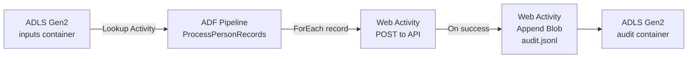

# ADF ADLS API Audit Pipeline — Lab in a Box

An end-to-end Azure Data Factory lab that reads person records from ADLS Gen2, POSTs each record to a public API endpoint, and writes a consolidated JSONL audit file back to ADLS Gen2 — all deployed in one click.

[](https://portal.azure.com/#create/Microsoft.Template/uri/https%3A%2F%2Fraw.githubusercontent.com%2FTheDataDojo%2Fadf-adls-api-audit-pipeline%2Fmaster%2Finfra%2Fmain.json)

> **Fork note:** If you have forked this repo, replace `TheDataDojo/adf-adls-api-audit-pipeline` in the button URL above with your own `<org>/<repo>` before deploying.

---

## Architecture



---

## What Gets Deployed

| Resource | Purpose |
|---|---|
| Azure Data Factory | Hosts the `ProcessPersonRecords` pipeline |
| Storage Account (ADLS Gen2) | `inputs` container for source files; `audit` container for audit output |
| System-Assigned Managed Identity | ADF identity granted **Storage Blob Data Contributor** on the storage account |

---

## Lab Instructions

### 1. Deploy

Click **Deploy to Azure** above. Fill in a resource group and a `resourceBaseName` (e.g. `adflab`). All resources will be provisioned automatically.

### 2. Upload sample input files

After deployment, navigate to the storage account → **Containers** → `inputs` and upload the files from the `/samples` folder of this repo:

| File | Format |
|---|---|
| `people_array.json` | JSON array of person objects |
| `people.jsonl` | JSON Lines — one object per line |

You can also use the helper script:

```bash
# Requires Azure CLI logged in
./scripts/upload-samples.sh <storageAccountName>
```

### 3. Run the pipeline

Open **Azure Data Factory Studio** → **Author** → `ProcessPersonRecords` → **Debug**.

| Parameter | Description | Example |
|---|---|---|
| `inputFileName` | File name in the `inputs` container | `people_array.json` |
| `inputFileFormat` | `json` for array, `jsonl` for JSON Lines | `json` |
| `apiUrl` | Target API endpoint | `https://httpbin.org/post` |

### 4. Verify API calls

The default endpoint is `https://httpbin.org/post`, which echoes the request body in its response. In the ADF **Monitor** view, click into the `PostToApi` activity output to see the echoed payload from httpbin.

### 5. Verify the audit file

Navigate to the storage account → **Containers** → `audit` → `<pipelineRunId>/audit.jsonl`.

Each line is a valid JSON object:

```json
{
  "personId": "1",
  "operation": "Create",
  "httpStatusCode": 200,
  "apiResponseSnippet": "{\"args\":{},\"data\":\"{\\\"personId\\\":\\\"1\\\",\\\"name\\\":\\\"John Doe\\\",\\\"age\\\":30,\\\"operation\\\":\\\"Create\\\"}\",\"files\":{},\"form\":{},\"headers\":{\"Accept\":\"*/*\",\"Content-Length\":\"68\",\"Content-Type\":\"application/json\",\"Host\":\"httpbin.org\",\"X-Amzn-Trace-Id\":\"Root=1-664f6e3c-1234567890abcdef12345678\"},\"json\":{\"age\":30,\"name\":\"John Doe\",\"operation\":\"Create\",\"personId\":\"1\"},\"origin\":\"52.202.10.1\",\"url\":\"https://httpbin.org/post\"}",
  "timestamp": "2024-01-15T10:30:00Z",
  "pipelineRunId": "abc123...",
  "activityRunId": "def456..."
}
```

> **Note on `operation` field:** The `operation` field is now read directly from the input record. If the field is missing from a record, it will be stamped as `Unknown` in the audit log.

---

## Audit Design Notes

The pipeline uses `isSequential: true` on the `ForEach` activity to enforce **sequential** append writes to the single audit blob per run. This prevents concurrent append corruption on the Append Blob. The tradeoff is throughput — records are processed one at a time. For high-volume scenarios, consider writing per-record audit files and merging downstream.

---

## Repository Structure

```
.
├── adf/
│   ├── factory.json                  # ARM template for all ADF artifacts (linked services, datasets, pipeline)
│   └── pipelines/
│       └── ProcessPersonRecords.json # Standalone pipeline definition for reference
├── infra/
│   ├── main.bicep                    # Bicep source — Storage + ADF + RBAC + nested ADF artifact deployment
│   ├── main.json                     # Compiled ARM template — used by the Deploy to Azure button
│   └── main.parameters.json         # Default parameter values
├── samples/
│   ├── people_array.json             # Sample input: JSON array format
│   └── people.jsonl                  # Sample input: JSON Lines format
└── scripts/
    └── upload-samples.sh             # Helper: uploads sample files to the inputs container
```

---

## Troubleshooting

| Symptom | Likely Cause | Fix |
|---|---|---|
| `BadRequest` or null body on `PostToApi` | Body not serialized as string | Ensure `@string(item())` is used in the Web Activity body |
| `AuthorizationPermissionMismatch` on audit write | ADF managed identity missing RBAC | Verify **Storage Blob Data Contributor** is assigned to the ADF identity on the storage account |
| `BlobAccessTierNotSupported` or 404 on append | Wrong endpoint type | Use the **DFS** endpoint (`dfs.core.windows.net`), not the Blob endpoint, for ADLS Gen2 append operations |
| Activity output reference error | Referencing output of a non-ancestor activity | In ADF, `activity(\'X\').output` is only valid inside the same `ForEach` scope where `X` ran |
