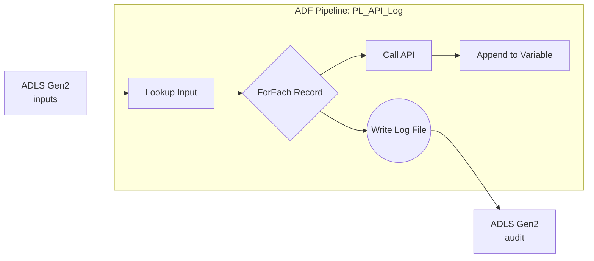

# ADF API Request Logging Pipeline - Lab in a Box

An end-to-end Azure Data Factory lab that reads records from ADLS Gen2, POSTs each record to a public API endpoint, captures the exact request payload for each call, and writes a consolidated JSON log of all sent requests back to ADLS Gen2 - all deployed in one click.

[](https://portal.azure.com/#create/Microsoft.Template/uri/https%3A%2F%2Fraw.githubusercontent.com%2FTheDataDojo/adf-adls-api-audit-pipeline%2Fmaster%2Finfra%2Fmain.json)

---

## Architecture



---

## What Gets Deployed

| Resource | Purpose |
|---|---|
| Azure Data Factory | Hosts the `PL_API_Log` pipeline |
| Storage Account (ADLS Gen2) | `inputs` container for source files; `audit` container for the final request log |
| System-Assigned Managed Identity | ADF identity granted **Storage Blob Data Contributor** on the storage account |

---

## Lab Instructions

### 1. Deploy

Click **Deploy to Azure** above. Fill in a resource group and a `resourceBaseName` (e.g. `adflab`). All resources will be provisioned automatically.

### 2. Upload sample input files

After deployment, navigate to the storage account → **Containers** → `inputs` and upload the files from the `/samples` folder of this repo:

| File | Format |
|---|---|
| `people_array.json` | JSON array of person objects |
| `people.jsonl` | JSON Lines — one object per line |

You can also use the helper script:

```bash
# Requires Azure CLI logged in
./scripts/upload-samples.sh <storageAccountName>
```

### 3. Run the pipeline

Open **Azure Data Factory Studio** → **Author** → `PL_API_Log` → **Debug**.

| Parameter | Description | Example |
|---|---|---|
| `inputFileName` | File name in the `inputs` container | `people_array.json` |
| `apiUrl` | Target API endpoint | `https://httpbin.org/post` |

### 4. Verify the request log file

Navigate to the storage account → **Containers** → `audit` → `request_log_<pipelineRunId>.json`.

The output is a single JSON object containing the `runId`, `timestampUtc`, and an array (`allSentRequests`) of the exact JSON payloads that were sent to the API:

```json
{
  "runId": "a1b2c3d4-e5f6-7890-1234-567890abcdef",
  "timestampUtc": "2024-01-15T12:00:00.000Z",
  "allSentRequests": [
    {
      "personId": "1",
      "name": "John Doe",
      "age": 30
    },
    {
      "personId": "2",
      "name": "Jane Smith",
      "age": 25
    },
    {
      "personId": "1",
      "name": "John Doe",
      "age": 31
    },
    {
      "personId": "3",
      "name": "Sam Jones",
      "age": 45
    },
    {
      "personId": "2",
      "name": "Jane Smith"
    }
  ]
}
```

---

## Pipeline Design Notes

This pipeline demonstrates a common pattern for capturing the exact data sent to an API for auditing or reconciliation purposes. It uses an `AppendVariable` activity inside a `ForEach` loop to collect the request bodies in memory, then a single `Copy` activity to write the entire collection to a file at the end. This is more efficient than writing a separate file for each request.

---

## Repository Structure

```
.
├── adf/
│   ├── datasets/
│   │   ├── DummySourceDataset.json
│   │   ├── InputDataset.json
│   │   └── OutputDataset.json
│   ├── factory.json
│   ├── linkedServices/
│   │   └── AzureDataLakeStorage.json
│   └── pipelines/
│       └── PL_API_Log.json
├── infra/
│   ├── main.bicep
│   ├── main.json
│   └── main.parameters.json
├── samples/
│   ├── people_array.json
│   └── people.jsonl
└── scripts/
    └── upload-samples.sh
```
