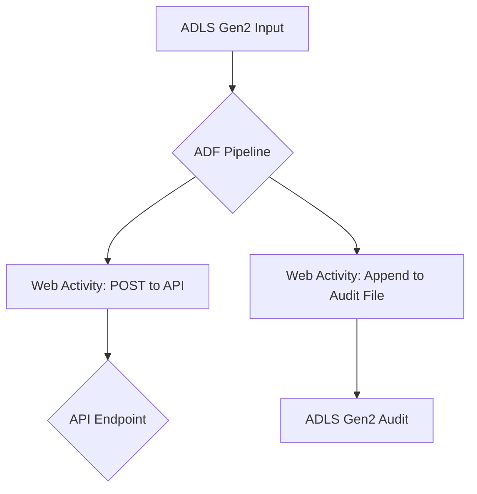

# Azure Data Factory - API Processing and Auditing Lab

This repository provides a complete "lab-in-a-box" to demonstrate a common data integration pattern using Azure Data Factory (ADF). The pipeline reads person records from Azure Data Lake Storage (ADLS) Gen2, processes each record by sending it to a public API endpoint, and logs the results to a consolidated audit file.

This project is designed to be production-grade in its structure and documentation, yet simple enough to be deployed and understood quickly.

## Architecture

The following diagram illustrates the overall architecture of the solution:

## Features

*   **Infrastructure as Code (IaC):** All Azure resources are defined using Bicep, enabling automated and repeatable deployments.
*   **Dynamic "Deploy to Azure" Button:** The README includes a fork-safe "Deploy to Azure" button that automatically works from your own fork of this repository.
*   **Flexible Input Formats:** The ADF pipeline can process both JSON array and JSON Lines (JSONL) input files.
*   **Robust Auditing:** A consolidated audit file is generated for each pipeline run, capturing the full payload, timestamps, run IDs, and API responses.
*   **Managed Identity:** The ADF pipeline securely authenticates to the ADLS Gen2 storage account using a system-assigned managed identity.

## Getting Started

### Prerequisites

*   An Azure subscription. If you don't have one, create a [free account](https://azure.microsoft.com/free/).

### Deployment

1.  **Fork this repository:** Click the "Fork" button at the top-right of this page to create your own copy of this repository.

2.  **Deploy to Azure:** Click the button below to deploy the resources to your Azure subscription. This will deploy the ARM template generated from the Bicep files in your forked repository.

    

    **How the Fork-Safe Button Works:**

    The "Deploy to Azure" button uses a special URL that dynamically resolves to the `main.json` ARM template within your forked repository. The `{{github.repository}}` placeholder is a feature of GitHub that automatically inserts the `owner/repository-name` of the repository where the README is being viewed. This makes the button work seamlessly from any fork without modification.

### Lab Instructions

1.  **Verify Resources:** Once the deployment is complete, navigate to the resource group you created in the Azure portal. You should see the following resources:
    *   Azure Data Factory
    *   Azure Storage Account (ADLS Gen2)

2.  **Upload Sample Input Files:**
    *   Navigate to the storage account, then go to **Containers**.
    *   You will see two containers: `inputs` and `audit`.
    *   Click on the `inputs` container.
    *   Upload the sample files from the `/samples` directory of this repository:
        *   `people_array.json`
        *   `people.jsonl`

3.  **Trigger Pipeline Run:**
    *   Navigate to the Azure Data Factory in the Azure portal and click **Launch Studio**.
    *   Go to the **Author** tab (pencil icon) and you will see the `ProcessPersonRecords` pipeline.
    *   Click **Debug** to trigger a new pipeline run.
    *   You will be prompted for the following parameters:
        *   `inputFileName`: The name of the input file in the `inputs` container (e.g., `people_array.json` or `people.jsonl`).
        *   `inputFileFormat`: The format of the input file. Use `json` for `people_array.json` and `jsonl` for `people.jsonl`.

4.  **Verify API Calls:**
    *   The pipeline sends POST requests to `https://httpbin.org/post`. This is a public test service that echoes the request body in the response.
    *   In the ADF monitoring view, you can inspect the output of the `PostToApi` activity to see the response from `httpbin.org`.

5.  **Verify Audit File:**
    *   Navigate back to the storage account and go to the `audit` container.
    *   You will see a new folder named with the pipeline run ID.
    *   Inside this folder, you will find the `audit.jsonl` file.
    *   Download and open the file. You will see a JSON object on each line, representing the audit record for each person processed by the pipeline.

## Troubleshooting

*   **BadRequest, Null, or Missing Body Errors in ADF:** These errors often occur when the `WebActivity` in ADF is not configured to send the body as a string. Ensure that the `body` property of the `WebActivity` is properly stringified using `@json()`.
*   **Storage Permission/ACL Issues:** If the ADF pipeline fails with authentication errors when accessing the storage account, verify that the ADF's managed identity has the **Storage Blob Data Contributor** role assigned on the storage account.
*   **Blob vs. DFS Endpoint:** This lab uses the DFS (Distributed File System) endpoint for ADLS Gen2, which is required for the `Append Blob` operation. If you are using the Blob endpoint, you may encounter errors.

## Included Files

*   **`/infra`:** Contains the Bicep files for deploying the Azure resources.
*   **`/adf`:** Contains the JSON definitions for the ADF pipeline, datasets, and linked services.
*   **`/samples`:** Contains sample input files in both JSON array and JSONL formats.
*   **`/.github/workflows`:** Contains a GitHub Actions workflow for linting the Bicep and JSON files in the repository.
